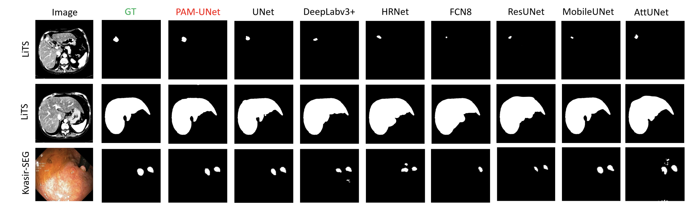

# 🔬 PAM-UNet: Progressive Attention Mobile UNet for Medical Image Segmentation

This repository contains the implementation of PAM-UNet, a novel architecture for medical image segmentation that combines mobile convolutions with a Progressive Luong Attention mechanism. 🧠💻


## ✨ Features

- 🚀 Lightweight architecture using mobile convolutions
- 🔍 Progressive Luong Attention for improved feature selection
- 🏥 Efficient segmentation of medical images
- 📊 Support for various medical imaging datasets

## 🛠️ Installation

1. Clone this repository:
   ```
   git clone https://github.com/yourusername/pam-unet.git
   cd pam-unet
   ```

2. Create a virtual environment and activate it:
   ```
   python -m venv venv
   source venv/bin/activate  # On Windows, use `venv\Scripts\activate`
   ```

3. Install the required packages:
   ```
   pip install -r requirements.txt
   ```

## 🚀 Usage

### 📁 Data Preparation

Place your dataset in the `data/` directory, organized as follows:
```
data/
├── train/
│   ├── images/
│   └── masks/
├── val/
│   ├── images/
│   └── masks/
└── test/
    ├── images/
    └── masks/
```

### 🏋️‍♀️ Training

To train the PAM-UNet model, run:

```
python src/train.py
```

You can modify hyperparameters in the `train.py` script.

### 📊 Evaluation

To evaluate the trained model on the test set, run:

```
python src/evaluate.py
```

### 👁️ Visualization

To visualize model predictions, run:

```
python src/visualize.py
```

## 📈 Results

Our PAM-UNet model achieves state-of-the-art performance on various medical image segmentation tasks. Here are some sample results:



Performance metrics on benchmark datasets:

| Dataset | Dice Score | mIoU | Recall |
|---------|------------|------|--------|
| LiTS    | 82.87%     | 74.65%| 92.14% |
| Kvasir-SEG | 84.8%   | 78.40%| 86.63% |

## 📚 Citation

If you use this code in your research, please cite our paper:

```
@article{das2024pam,
  title={PAM-UNet: Shifting Attention on Region of Interest in Medical Images},
  author={Das, Abhijit and Jha, Debesh and Gorade, Vandan and Biswas, Koushik and Pan, Hongyi and Zhang, Zheyuan and Ladner, Daniela P and Velichko, Yury and Borhani, Amir and Bagci, Ulas},
  journal={arXiv e-prints},
  pages={arXiv--2405},
  year={2024}
}
```

## 📄 License

This project is licensed under the MIT License - see the [LICENSE](LICENSE) file for details.

## 🙏 Acknowledgments

- Thanks to the authors of UNet and MobileNet for their foundational work
- Gratitude to the LiTS and Kvasir-SEG dataset creators for providing benchmark data

## 🤝 Contributing

Contributions are welcome! Please feel free to submit a Pull Request.